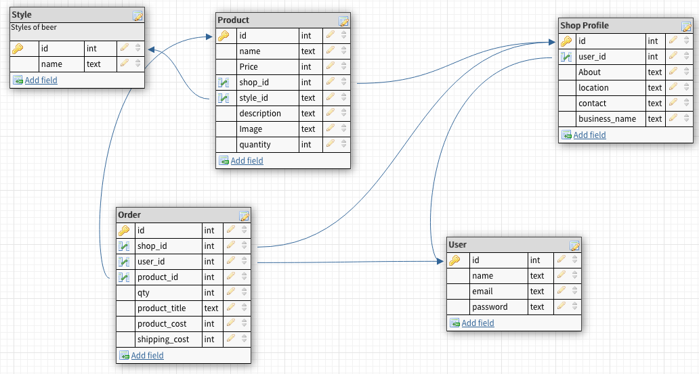
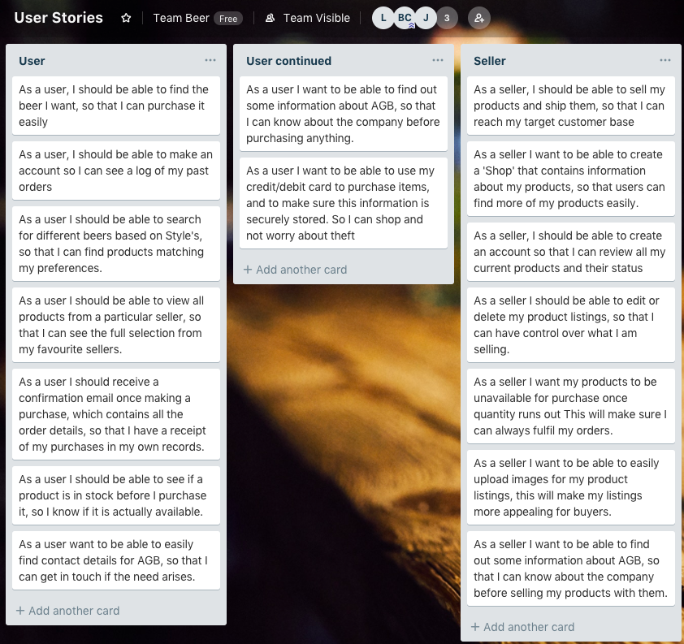
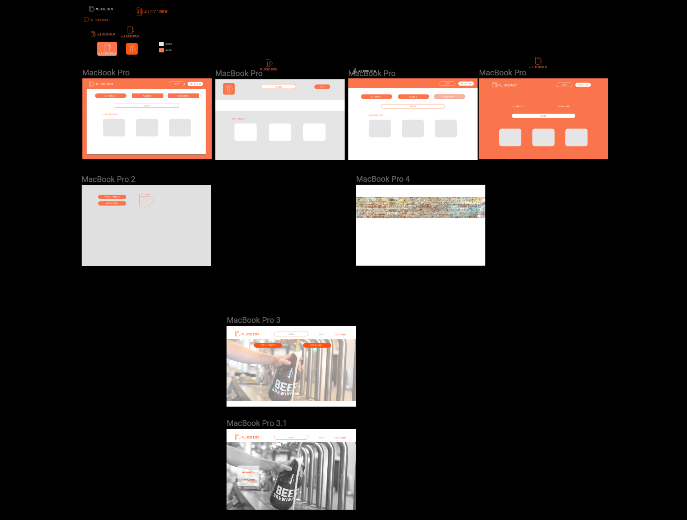
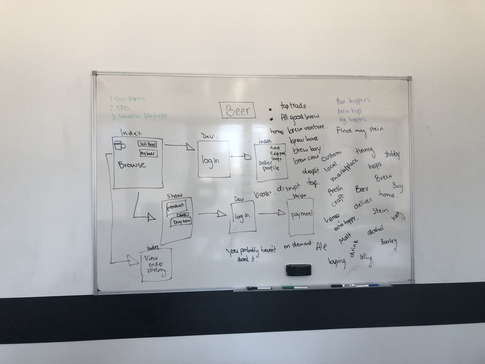
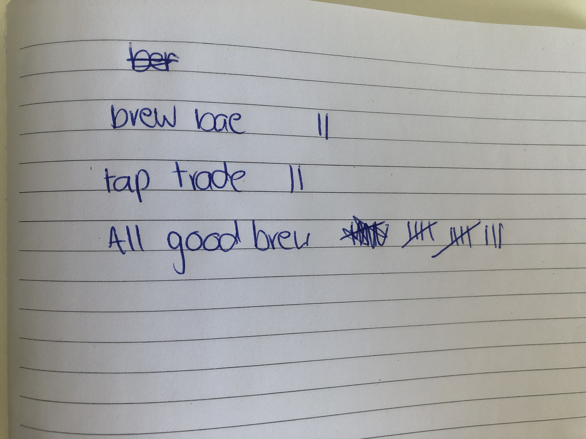

# PROJECT FIERCE HOLLOWS #

Link to our app

[Link to App](https://fierce-hollows-41698.herokuapp.com/)
    
Link to our GitHub repository

[Link to GitHub Repository](https://github.com/jmerrigan/allgoodbrew)
    
### ABOUT ALL GOOD BREW ###

All Good Brew has been designed to allow craft breweries and home breweries to promote and sell their wares and for customers to be able to buy them. Those who are buyers can also sell and vice versa. The app has been designed to follow a principle of simplicity and ease of use.

### SHORT ANSWER QUESTIONS ###

- What is the need (i.e. challenge) that you will be addressing in your project?

    The challenge that we are trying to address in our project is giving brewers the opportunity whether they be micro or not, to sell their beer, and for beer enthusiasts to have one central spot where they can find beers to purchase and have delivered to their front door. Whether it be whatever is on tap at your local pub or a new brewery starting in someones garage all are available for people to try. 

- Identify the problem you’re trying to solve by building this particular marketplace App?

    The problem we're trying to solve is that there is currently limited access for those who want to buy alternative or micro brewed beears and also limited access for the producers to sell those beers. Whilst there may be a few bottle shops around that stock micro brews they aren't as conveniently available as products which are available on sites such as Dan Murphys. We provide an alternative range of products with the online convenience of a major provider.

- Why is it a problem that needs solving?

    Currently if someone wants to buy beer from a micro brew (we've tried!) it can be a tricky process, or require going to a specific bar or bottle shop that could be across the city. On the other hand for brewers it is a difficult process trying to get mainstream sites and providers to stock your product, going to venues and trying to entice them to have your product on tap or in their fridges, all of which is very hard work. We're giving the brewers access to a wider marketplace and customers access to a wider range, which are easier for both parties to utilize.

- Describe the project will you be conducting and how. your App will address the needs.

    We decided a good way to address the above problems would be to make the App as a 2 sided marketplace, those who are into making beer are also into trying out new ones, and vice versa so people in that community can sell beer as easily as they can buy it.

- Describe the network infrastructure the App may be based on.

    This app will be hosted on a combination of Heroku and AWS. Heroku is the platform from which our app will run and be hosted on and AWS is where the user entered data such as images and descriptions of their products and stores will be stored.

- Identify and describe the software to be used in your App.

    We will be making our app with a combination of the below software.

    - Ruby on Rails
        Ruby on rails is the main software that our App will be based on, Ruby on Rails is a server side web application framework written in Ruby. Ruby on Rails structure operates as Model View Controller (MVC), and it provide default structures for web based applications, databases and web pages. 

    - Ruby
        Apart from the fact Rails is written in Ruby, our App uses much embedded Ruby in our HTML files for the presentation of data to our users, using instance variables and if statements. Ruby is a object-oriented general purpose programming language written in C.

    - CSS (SASS)
        We have used CSS to style our content pages, adding in our logo, various images, boxes for text and links to appear in and defining how they appear to the user. CSS is a style sheet language used to specify the styling of documents written in markup languages like HTML.

    - HTML
        We used HTML for define the content that would appear in our pages for our users. We also used embedded Ruby within our HTML files to pull data from the database using instance variables. HTML is a markup language for creating web pages and applications.

    - Postgres
        PostgreSQL was the database system we used for our app. PostgreSQL is an object-relational database management system.

    - Heroku
        We have used Heroku to host our app, as it allows relatively easy deployment and integration with AWS to store our user submitted data. Heroku is a cloud platform service that supports several programming languages.

- Identify the database to be used in your App and provide a justification for your choice.

    Postgres is the database we have used in our app. There are many benefits Postgres offers over SQL and other databastes. Some of these benefits include:
    - There are more supported datatypes which allow you to store your data in a type that is most relevent to the instance
    - It is open-source and free
    - There are no associated licensing cost for the software which means you cannot overuse the database
    - Realiable and stable
    - It works cross platform
    - Designed for high volume environments
    
    Even though Postgres is the most reliable database, there are still some disadvantages. Some of these disadvantages may include:
    - It is not suitable for fast read operations and can be considerably slower than MySQL
    - If you require a simple set up, Postgres may be the more difficult route to take
    - It is harder to come by hosts or service providers that offer managed PostgreSQL instances 

- Identify and describe the production database setup (i.e. postgres instance).

    Our database is made up of six models (application_record, user, shop_profile, order, product and style), five controllers (application, charges, pages, products and shop_profile) and multiple views.

    Each model was created with a particular purpose in mind:
    - user: a database for all buyers and sellers
    - shop_profile: this allows a user to create a shop in order to sell their products
    - order: this allows us to store all products sold along with associated details so as a buyer or a seller you are able to reference previous orders
    - product: this allows a user with a shop to create products to be sold under that shop
    - style: this allows a user to associate a style of beer when creating a product which assists with the ease to search for a particular style of beer

    The five controllers hold methods we created to be able to be called upon within the views. This means we are able to pull relevent data from the databases to be displayed to the user.

- Describe the architecture of your App.

    All Good Brew is an app created as a marketplace for home brewers and craft breweries to sell and promote their products. To improve user experience we have installed gems such as Devise, Pundit, Stripe and Mailgun. 

    1. Devise has allowed for easy storage and use of user data, including their name, email and password
    2. Pundit was installed for proper authentication of our users information
    3. Stripe is used as a payment system with in-built abilities to safely make use of users payment details
    4. Mailgun is a sufficient way for us to send emails to our buyers and sellers about their product purchases

- Explain the different high-level components (abstractions) in your App.

    All the gems we used are an abstraction from our own ruby code. Devise, Pundit, Stripe and Mailgun were implemented as extensions to our app to allow for functionality and user experience. 
    Active record is used to store data inputed by the user. It allows for the use of methods to create, read, update and delete data. This is necessary for use in our two-sided marketplace as users are able to CRUD shops and their associated products.

    It also makes it extremely seemless to pull and display data for our users.

- Detail any third party services that your App will use.

    Stripe is a third party service our app uses to process users personal data when purchasing a product. Stripe complies with the Payment Card Industry Data Security Standards (PCI DSS). 

- Describe (in general terms) the data structure of marketplace apps that are similar to your own (e.g. eBay, Airbnb).

    All Good Brew shares a similar data structure to eBay where a user can be a buyer and a seller. As a seller they are able to create a shop with which they can create multiple products to sell.

- Discuss the database relations to be implemented.

    The models that contain foreign keys are shop_profile, product and order. When a shop profile is created, they must be associated with a user. There is one shop profile to one user. The products model holds a foreign key for shop_profile and style. One shop profile can have many products and each product has one style.
    When an order instance is created, they are linked to a user (the buyer) as well as the shop_profile with which the product came from. You can find the user who is the seller by going through the shop profile model which is linked to the user model.

- Describe your project’s models in terms of the relationships (active record associations) they have with each other.

    - A user can have one shop_profile
    - A shop_profile can have many products
    - A product will have one style and one shop_profile
    - An order will have one shop_profile and one user

- Provide your database schema design.

    

- Provide User stories for your App.

    

- Provide Wireframes for your App.

    

- Describe the way tasks are allocated and tracked in your project.

    Within our group we allocated tasks on a rotational basis, throughout the day all 3 of us would get a chance to code on our machines, pulling from our master branch, making our own, working on the days agenda, agreeing on the changes, merging that branch with the master and pushing back up.

- Discuss how Agile methodology is being implemented in your project.

    Each day we would begin with a stand up, discussing the agenda of the day which was set the day before. Each day would finish with a stand up discussing what we had accomplished, what we found difficult and what we wanted to achieve the following day. Each of these items would be put in a list in the order that we wanted them to be completed in and we would then discuss in which order people would be working on the code. Whilst working on the code after constructing a working version of what we were trying to accomplish we would try different ideas and change our requirements as we went along. 
    
    When we uploaded code or ticked an item off as done it would only be after we had a proper working version of that code implemented, no item was considered finished or complete until it properly worked and was thoroughly tested. Throughout the development process and at the end of each day we would also discuss how we worked well together, where we thought time was well spent and where it wasn't, how we were most effective and how we weren't. We found implementing these Agile methods made us an effecient and effective group, we all gained from this collaborative experience.

- Provide an overview and description of your Source control process.

    Each day when working out which agenda items we were going to work on we would discuss in which order people would be the primary coders throughout the day, this was also down to personal preference and if group members felt they needed more practise on a particular aspect of coding then they could be the principal coder for that aspect of the work. Our source code is held on GitHub and when any of us were working on an aspect we would pull down the origin code, branch off and work on our agenda items. When we had all agreed on and tested the final code we would commit and push the modified code back up to our repository, then the next person to be the principal coder would pull down and repeat the same process again.

- Provide an overview and description of your Testing process.
    
    Throughout the development of our application we would test the functionality of features as they were added in. No agenda item for a day was considered complete until it was fully tested and worked perfectly with already existing aspects of our App. Testing front end features was a bit more in depth as we had to check how different image sizes would work as well as when we added additional products how they would work together on the page. Ultimately the same principle would always apply, no different item or feature would be worked on until the existing one was working.

- Discuss and analyse requirements related to information system security.

    Proper handling of user data is an extremely important consideration when running any business that collects and uses user data. Whilst we are providing our users, whether they be buyers or sellers a service they are providing and trusting us with their personal information so all steps must be taken to protect their data as if it were our own. User trust is essential to running a successful enterprise. When envisioning what our app would be, protection of user data was a central discussion point, as specified below we have used several gems and secure third party services to add functionality to our app whilst protecting their information at the same time.

- Discuss methods you will use to protect information and data.

    We used the below methods to protect user information and data.

        Encryption - We used devise for initial login method and to securely store our user data. Devise has automatics  hashing of critical user information.

        Stripe - Stripe is our main payment system, allowing us to receive user payments via credit card whilst keeping the sensitive user payment data completely anonymous.

        Pundit - In order to keep certain aspects of the site out of reach of users depending on their account and access level we have used Pundit. Pundit has allows us to hide the ability to edit or destroy existing stores if they are not logged in as the owner of that store, the same goes with the products those stores sell. As well as hiding the buttons or changing the buttons that may show to a user depending who they are we have also limited access to certain paths within the site, so if a user manually enters 'store_name/edit' into the url they will be barred access to that page.

- Research what your legal obligations are in relation to handling user data.
    
    As specified in the Privacy Act 1988 as an entity that collects user data we have legal obligations to perform the following:

    Protect personal information from:
        - Theft
        - Misuse
        - Interference
        - Loss
        - Unauthorised access
        - Modification
        - Disclosure
        
    Take reasonable steps to destroy or de-identify personal information when it is no longer needed for any purpose permitted under the Privacy Act 1988. This might include shredding documents or storing them in a secure area.

## WEEK 1 LOG ##
 
 Below is a log of how we worked during our first week, how we came up with the idea, the issues we tackled and how we overcame them.

 ### DAY 1 ###

- We found out our group members and got together to put forward our ideas on what our two sided marketplace should be about. Laurence put forward an idea for a carsales style site and James suggested a site for people to buy and sell beer, especially giving small brewers an avenue for small brewers to sell their products.

- We all liked the beer marketplace website idea and started thinking about how the website would function, we liked the idea of keeping it very clean, and allowing people to buy and sell from one account. We also want the site to be open to visitors, and let people browse freely without creating an account.

- We did a brainstorming session to show how the app would function and had a buzzword session on the board to come up with possible names we could use.

- We started thinking about names and after using a few name generators and writing a bunch of beer related words on the whiteboard starting combining names together to see what we could come up with. Three options stood out, they were: Tap Trade, Brew Bae & All Good Brew. Biance took these 3 options to people around the campus and fielded their opinions, and All Good Brew won the majority of votes by a far margin.

Choosing the model and scaffold structure
- We are scaffolding the product, we will be doing crud for the shops manually.

- Whilst adding in the models we have been branching, committing and regularly testing to avoid later problems

- We are now creating a model for orders, we are linking in the shop and user id's. For orders especially when taking into account order history we are saving things such as price, product and shop name as text so that if the shop changes the details of their items later it won't affect what is already in the database . This table should function as a timestamp of what everything was called and how much it cost when the order was placed. We will have to include a convert order info to string method inside the code for when the order goes through.

- We are now adding in the image upload functionality for the products using rails active storage module. 

- We have tried to test the image upload function but found that shop the shop profile must exist before we were able to create a new product. We decided to then delete the shop model and we're now going to scaffold it as we remembered we need a shop profile view page so scaffolding will be necessary and we won't have to manually CRUD it out.

- ** FIRST ERROR ** 
When we tried to scaffold a shop, because of the OOR it tried to create an order model before creating the shop model, we deleted it and didd a db rollback, tested and we are able to create a shop profile

- Scaffolded the product model

- We are now creating a order model

- We are now setting the relationships for the models, shop has many products, user has many orders, we aren't doing user has many shops at this stage, depending on functionality

- We were able to call the shop profile for the current user, fixed the association between user and shop, removed the field from the user interface when creating a new product and when product is created the shop profile was automatically pulled

- Users are now able to sign up, create a store, and product with an image. We have inserted links into all the pages allowing us to navigate around the site to assist with testing

### DAY 2 ###

- We realised we are going to need a table for the styles of beers so that these are pre determined fields and we don't have users entering their own styles with different spelling or caps/not caps. 

- We also noticed there are missing fields in the order table, the quantity of items. This also raised the question of are we going to allow the user to order in different quantities, are we going to limit the seller to only offering items in forms of keg or six packs, or allow the seller to offer different types and then allow the user to choose.

- The seller is going to have to do seperate listings if they want to offer different types of quantity for their product. We looked at implementing a cart so the user can order several different items but this may add a greater degree of complexity than we currently need as we will have to implement user sessions and likely make additional changes to our database, we consider this a stretch target for later addition.

- We initially wanted to allow the user to choose between beer and cider, however for now we are going to stick to offering beer, and will look into implementing cider as a choice should we decide to later once we have achieved our MVP.

- We're adding in a style database, this will be seperate to the product database and will have the pre populated fields for for the style of beer, the style database is only going to have id and name, this will be a foreign key for a paired style column in the products table. A seed file for the styles is being made so we an pre populate that table and not have to manually enter each style in the rails console.

- We wanted to edit the order table to include fields such as quantity and shipping cost. We ended up deleting the table and creating it again, but found that even though we deleted the table there were still past test orders in the database which were clashing with the replacement table we were trying to create, so we wiped the enter database and then were able to add in the replacement style table. The products table was also updated and with these both done we were able to seed in the styles.

- Next was implementing the style selection for when the user wants to create a product with a drop down list. This was done using HTML forms, and we were able to also put in a default blank selection prompting the user to choose a style of beer. We then fixed up the show pages so they displayed the style names rather than the style ID's.

- We're now changing when a guest user is prompted to log in, so when they want to create a shop, product or make a purchase they are asked to log in or create an account. We also want to link be able to link the user to their own shop profile whilst they are logged in, and if they already have a shop profile they will only be able to edit this

- We made the decision that a shop can never be destroyed, this saves the order history so that record will always exist even if the store is no longer in use.

- We have links dependent on who is actually logged in, pundit to remove access to the actual route and ruby if statement to remove the links themselves dependant on who is actually logged in so even if you specifically put a /edit or /delete on the back of the url and you weren't the appropriate user it will still block access

- We implemented back button into application html file so it appears on all pages, and rather than having a specific route just takes you to the page you were on last

### DAY 3 ###

- The day was started by implementing dotenv into our app to protect our keys
- We then began stripe integration into the app, we've successfully tested Stripe

- When we are creating a new product when we enter the price it is representing it as cents, we tried doing a conversion by mulitplication in the show page, this didn't work so we ended up doing it in the product controller which worked

- Next is to deploy our app to Heroku

- The app would not run and we were getting a H10 error, after the logs not telling us anything useful we ran rails console which showed we had a syntax error in the storage.yml file where we were declaring the AWS keys

- After fixing the above error the app successfully deployed, however when we created an account, store and then tried to create a new product the pre populated drop down list for the style of beer wasn't loading any options, the seed file when pushed to herkoku was commented out, we uncommented these, re added the file and pushed it to heroku again and then ran db seed on the heroku server which seeded the drop down list for style of beer, it now works!

- We realized that we didn't have a method to store the orders that the shop receives, so within the charges controller we put a method to store the orders that are received in the database, this was successful. We did not add a method to save the shipping cost of the order as we currently don't have a way to specify what it is, however we have put adding shipping costs and details into what we would like to accomplish tomorrow, we will look into the possibility of this being an element of Stripe that we can utilize.

- Next up was adding in the functionality to be able to search the website, we found a fairly simple search method to follow, within the products controller we inserted a method for product search, we then also made a product search page for results to display. Within the product search method we then used a LIKE method for the search method to be able to use fragments to look for results that match up and then put downcase on the end of the product search method so capital letters were no longer an issue

- The search function however does not seem to like searching within multiple tables via foreign keys so instead we are going to declare seperate search methods for each of the categories that we want the user to be able to search by. We were still having difficulty with the search function being able to read other tables via foreign keys so we decided to cap the search function to the product name and description for now

- Our next task was the integration of mailgun, we wanted to not only notify the buyer of their successful purchase but also the seller of their successful sale. We attempted to put both of the email recipients in the product mailer within the same code line but currently only the seller is receiving emails after a purchase has gone through. The solution we found to this problem is putting the seller and buyer emails within an array inside the product mailer method. Ideally we would like it to send different emails to buyers and sellers, we've added this to our list of things to tackle for the next day, we have a few ideas of how we would actually do this, a new view for the emails and a new method to send to the other recipient.

### DAY 4 ###

- We began the day working on styling, starting with our nav bar. Bianca had done some Figma mock ups on her computer and we agreed on the basic styling of the home page, however when we moved to James' computer we had difficulty getting the same colour in CSS as we saw on Bianca's computer as she has her night shift feature constantly on which removes the white and blue light from the screen! To get the colours the same we had a play around with colour wheel and and found a site called colour lovers which alowed is to find the closest match.

- We then worked on adding our logo into the nav bar, but were having a constant issue with the pathing of the svg image that we pulled from Figma, the solution to this issue was to declare the image path just starting with '\assets' rather than declaring the full path of the image.

- Now we are on to the CSS styling, there is, as always a lot of poking and prodding as the code trying to make it look just how we want it. We had difficulty with getting our buttons to work just how we wanted, whilst were were able to put the 'login' text within the box the user would have to click on the text rather than just being able to click on the button itself. After resolving this we were able to put the other buttons into the nav bar as well, the buttons also have a little bounce effect.

- We have rethought the design of the site, instead of having an orange nav bar and then the rest of the page white we decided to give the page a surrounding orange border and have the white background for the content sitting under the nav bar to be sitting within a white area surrounded by the orange border. 

- We're coming back to the navbar, and trying to get the buttons to appear on the right hand side, we ended up using flexbox which allowed us to align the items on the RHS using space between.

- Content, nav bar and button styling, working on the view all products and view all stores pages to align themselves to the center but also on top of the search bar was quite tricky, there was lots of adjusting in CSS